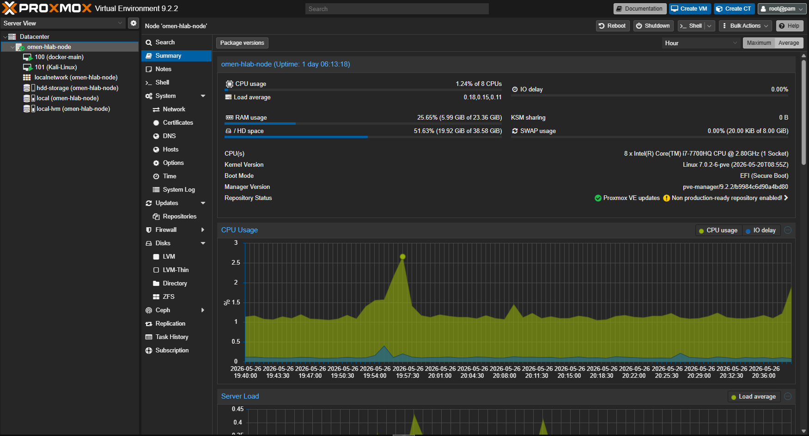
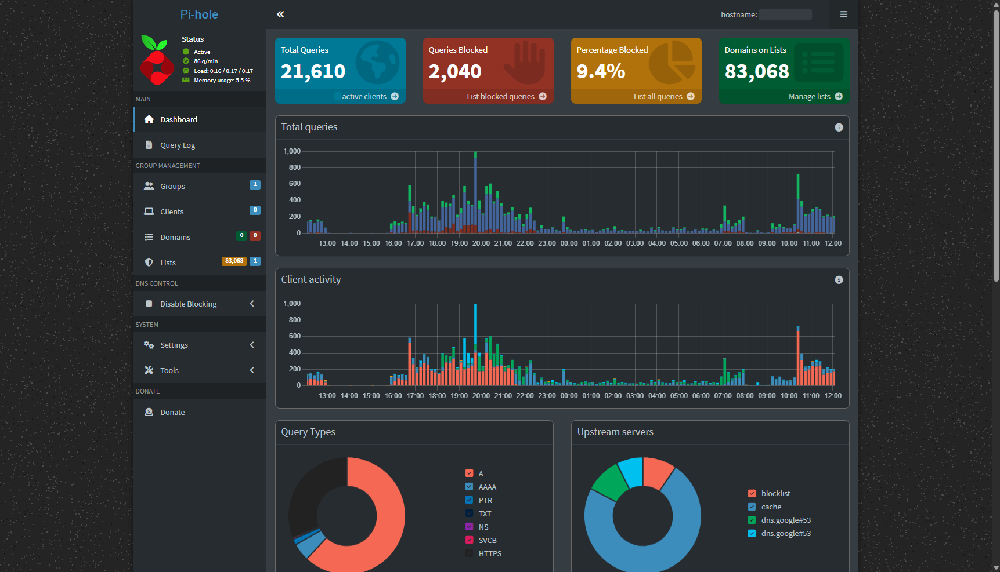
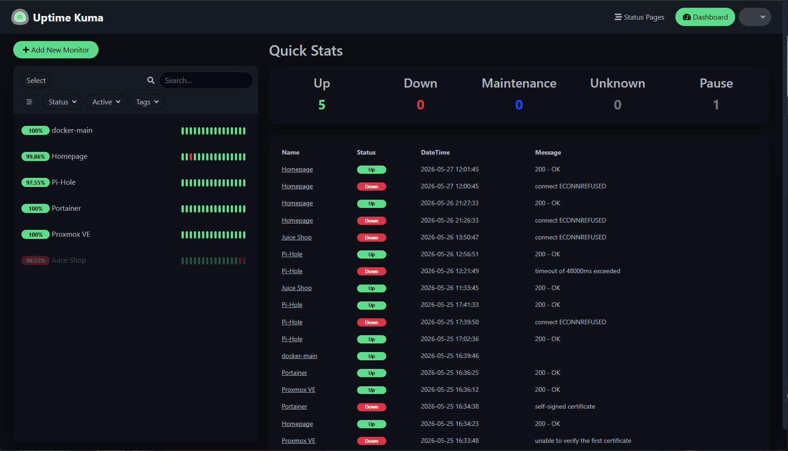
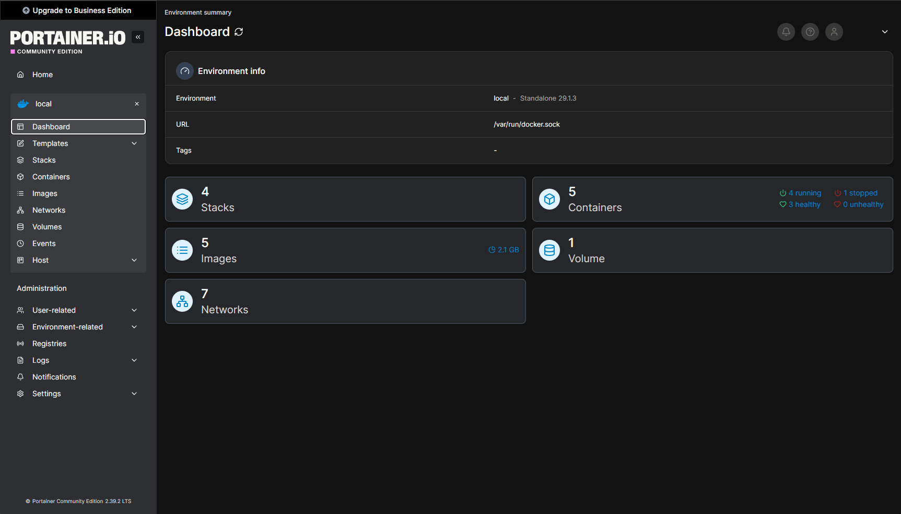
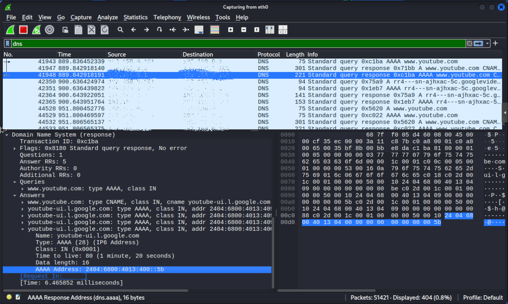
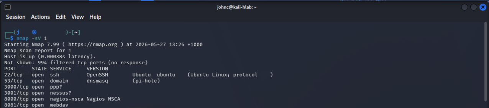
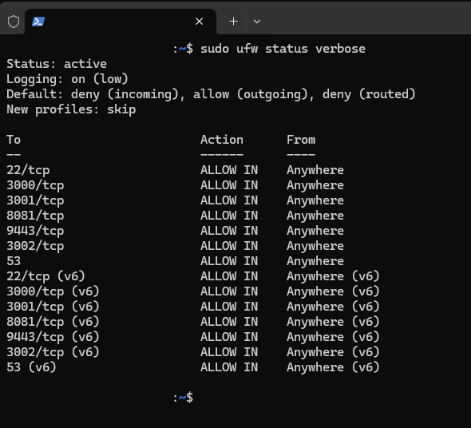

# SOC Homelab

## Overview
Built a virtualized cybersecurity homelab using Proxmox VE to simulate enterprise-style infrastructure and SOC workflows.

---

## Technologies Used
- Proxmox VE
- Ubuntu Server
- Kali Linux
- Windows 11 Pro
- Docker
- Pi-hole
- Portainer
- Uptime Kuma
- Wireshark
- Nmap

---

## Skills Practiced
- Network analysis
- Linux hardening
- DNS monitoring
- Vulnerability investigation
- Service monitoring
- Incident documentation
- Virtualization
- Infrastructure troubleshooting

---

## Lab Architecture
### Proxmox Infrastructure

The homelab environment is hosted on Proxmox VE and includes Ubuntu Server, Kali Linux, and Windows virtual machines used for infrastructure management, security monitoring, network analysis, and SOC-style investigation workflows.

## Pi-hole DNS Monitoring

Implemented Pi-hole for DNS filtering, visibility, and network telemetry monitoring within the homelab environment. Used to analyse DNS activity, blocked queries, client behaviour, and upstream resolver activity.

## Service Monitoring with Uptime Kuma

Configured Uptime Kuma to monitor the availability and health of self-hosted infrastructure and Docker services. Used to track outages, service interruptions, response failures, and uptime statistics across the homelab environment.

## Docker Container Management

Used Portainer to manage Docker containers, stacks, networks, and self-hosted services within the homelab environment. Implemented containerized infrastructure for monitoring, DNS filtering, dashboards, and security testing applications.

## Wireshark DNS Traffic Analysis

Captured and analysed live DNS traffic using Wireshark within the homelab environment. Practised packet inspection, protocol filtering, DNS query and response analysis, and network traffic investigation to better understand client-server communication and DNS resolution behaviour.

Key activities performed:
- DNS traffic capture and filtering
- Packet-level inspection of DNS queries and responses
- Analysis of IPv4 and IPv6 DNS records
- Investigation of CNAME and AAAA record resolution
- Network troubleshooting and traffic visibility exercises

## Network Reconnaissance with Nmap

Performed network reconnaissance and service enumeration using Nmap from a Kali Linux virtual machine within the homelab environment. Identified exposed services, open ports, and running applications to better understand infrastructure visibility and attack surface exposure.

Activities performed:
- TCP port scanning
- Service and version detection
- Host discovery and enumeration
- Infrastructure exposure assessment
- Basic attack surface analysis

## Linux Firewall Hardening with UFW

Implemented and configured UFW (Uncomplicated Firewall) on the Ubuntu Docker host to restrict inbound traffic and control exposed services within the homelab environment. Applied firewall rules to secure management interfaces and self-hosted services while maintaining required service accessibility.

Security controls implemented:
- Inbound traffic filtering
- Default deny policy for incoming connections
- Controlled exposure of service ports
- SSH access management
- Basic Linux host hardening

---

## Security Activities
- Nmap reconnaissance
- Wireshark packet analysis
- DNS visibility investigation
- SSH hardening
- UFW firewall configuration
- Fail2ban deployment

---

## Future Improvements
- Wazuh SIEM
- Active Directory
- Sysmon logging
- Security Onion
- Splunk
- Centralized logging
- SOC alert simulation
